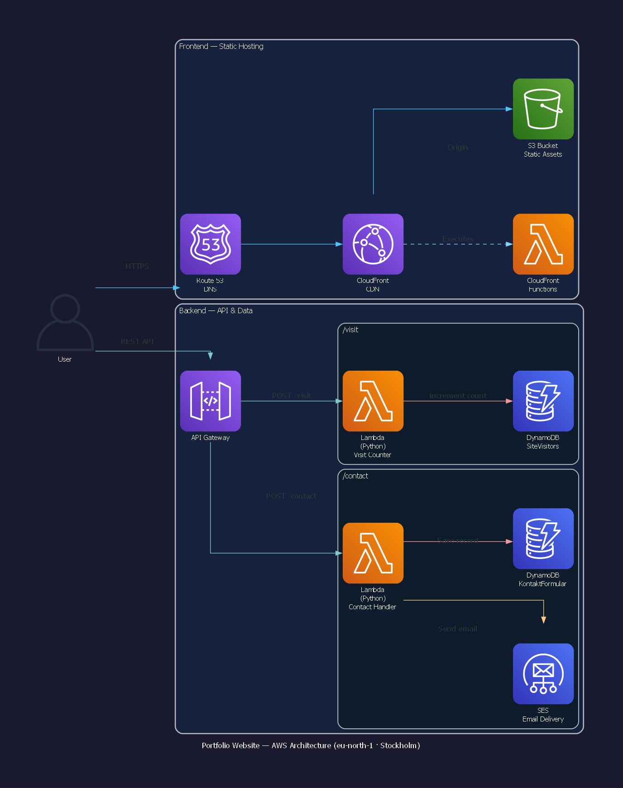

# Serverless Portfolio Website (Frontend & CI/CD)

Welcome to the frontend repository of my personal portfolio website. This project showcases a modern, secure, and fully automated static website architecture hosted entirely on AWS.

Live Demo: [Insert your Route 53 domain link here, e.g., https://yourdomain.com]

## Architecture Overview
This frontend is built using clean HTML5, CSS3, and JavaScript, designed to communicate dynamically with a serverless backend. 

_Architecture diagram automated and generated using **AWS Kiro CLI** and **Model Context Protocol (MCP)**._

### Key Frontend Features:
* **Pretty URLs:** Implemented using **CloudFront Functions** to automatically rewrite paths in the background, allowing clean navigation (e.g., `/about` instead of `/about.html`).
* **Industry-Standard Security:** Reached an **A-Grade rating on Security Headers** by injectnig strict security policies (CSP, HSTS, X-Frame-Options) globally at the edge via CloudFront.
* **Dynamic Integrations:** Features a contact form and a live visitor counter that interacts asynchronously with custom AWS APIs.

## CI/CD Pipeline (GitHub Actions)
The deployment of this website is 100% automated. Every `git push` to the `main` branch triggers a GitHub Actions workflow that:
1. Securely authenticates with AWS using **OIDC (OpenID Connect)**—eliminating the need for permanent, insecure AWS Access Keys.
2. Deploys updated files directly to an **Amazon S3** bucket.
3. Automatically triggers an **Amazon CloudFront invalidation** to clear the global edge cache, making updates live in seconds.

---

## 🛠️ Looking for the Infrastructure?
The entire backend ecosystem supporting this website was provisioned using **Infrastructure as Code (IaC)**. 
👉 Check out the full CDK and Python repository here: [mickol66/portfolio-infra](https://github.com)
